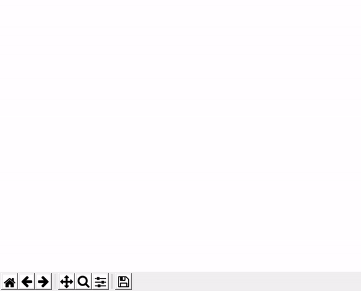

# Visualizing-learning-process-of-Neural-Network

## Neural Networks
A neural network is a series of algorithms that endeavors to recognize underlying relationships in a set of data through a process that mimics the way the human brain operates. Neural networks can adapt to changing input so the network generates the best possible result without needing to redesign the output criteria. The conception of neural networks is swiftly gaining popularity in the area of trading system development.

One of the most striking facts about neural networks is that they can compute any function at all. The repository here shows how a neural network learns to replicate the `sigmoid` function. Tensorflow is used for creating and training the network. Thw network used is a simple feed-forward network with `1` input unit, `2` hidden units and `1` output unit with `tanh` as activation for the hidden unit. The learning process is shown below.

Feel free to play around with code!!
